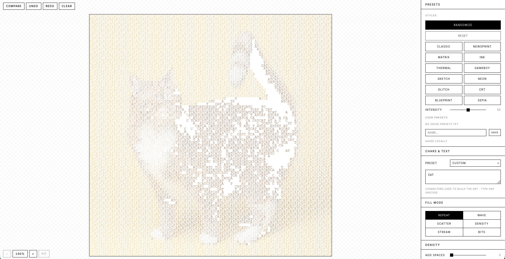

# ASCII Tool

A browser based tool for converting images, GIFs, videos, and webcam feeds into ASCII art.



*Figure 1. The main interface: canvas on the left, tool sidebar on the right.*


*Figure 2. An ASCII output example.*

## Features

### Input

- Drop, click, or paste images (Cmd/Ctrl+V) anywhere
- Load images from a URL
- Drop or pick video files (MP4, WebM, GIF); frames are converted live
- Webcam capture (use the page as a live ASCII filter)
- Built in example images (sourced from Unsplash and royalty free under the Unsplash License)

### Characters and fonts

- Custom character ramp (type any Unicode: blocks, braille, katakana, symbols)
- 13 ramp presets: CLASSIC, DENSE, BLOCKS, SHADE, DOTS, BINARY, BRAILLE, KATAKANA, MATRIX, HEX, ASCII-ART, EDGE, NEWSPRINT
- 11 monospace font choices (system fonts plus Fira Code, IBM Plex, Space, Inconsolata, VT323, Press Start 2P, Silkscreen)
- Six fill modes (REPEAT, WAVE, SCATTER, DENSITY, STREAM, BITS)

### Frame processing

Applies to every frame of the active source, whether it is a still image, a GIF, a video, or the webcam.

- Brightness, contrast, saturation, gamma, invert
- Hue shift, tint color and strength
- Blur, sharpen, edge detect (Sobel), posterize, dither (Floyd Steinberg), threshold
- Rotate 0 / 90 / 180 / 270 degrees, flip horizontal, flip vertical

### Color

- Photo color or solid text color
- Palette quantization (MONO, GAMEBOY, GB POCKET, CGA 0/1, NES, TERM 16, PICO-8, SEPIA, THERMAL)
- Duotone mapping with light and dark color pickers
- Background: solid color, two stop gradient with angle, or background image
- Transparent background option

### Animation

- Toggleable with speed and intensity sliders
- Eight modes: WAVE, PULSE, RAIN, GLITCH, ERROR, SCAN, TYPE, CORRUPT

### Style presets

- Built-in preset styles
- A "RANDOMIZE" button (or press Space) for a quick remix
- Save your own named presets to localStorage; load and delete from the sidebar

### Export and sharing

- PNG (raster) at 1x to 4x scale
- SVG (vector, infinite zoom)
- HTML (self contained, per cell color, embeds the chosen webfont)
- GIF (animated)
- WebM or MP4 (animated, via MediaRecorder; codec chosen by browser)
- Copy as text
- Copy share link: encodes the full configuration in the URL hash; paste anywhere and the recipient sees the same look (images themselves are not bundled)

### UX

- Undo and redo (Cmd/Ctrl+Z, Cmd/Ctrl+Shift+Z) or the UNDO and REDO buttons
- Hold C (or hold the COMPARE button) to A/B against the original image
- Press Space for a random preset
- Arrow keys cycle through example images
- Mobile layout: sidebar slides in from the right under 900px; tap CONTROLS to open

## How it works (stats and math, abstract level)

The pipeline turns a frame into characters in a few stages. The notes below are intentionally high level; see the source for exact constants.

### Luminance

Each pixel is reduced to a perceptual brightness value using the standard Rec. 601 weights:

```text
L = 0.299 R + 0.587 G + 0.114 B
```

That single channel feeds brightness, contrast, threshold, edge detection, and the character index lookup.

### Frame statistics

When a new source is loaded (image, GIF, video, or webcam), a representative frame is downsampled to a small working size (long edge around 96 px) so the analysis is fast. From that thumbnail the tool computes:

- Mean brightness: average of L across all pixels.
- Contrast: standard deviation of L (a spread metric, not a min/max range).
- Mean saturation: average of (max(R,G,B) minus min(R,G,B)) divided by max, a cheap HSV style saturation.
- Edge density: fraction of pixels whose Sobel gradient magnitude exceeds a fixed threshold.
- Subject centroid: an edge weighted center of mass, used to bias framing.

Boolean flags (isDark, isFlat, isBusy, isMonochrome) come from thresholding the values above. The example overlay system uses these to pick per source defaults (more cells for busy scenes, higher threshold for dark scenes, and so on).

### Edge detection (Sobel)

A 3 by 3 Sobel kernel approximates the frame gradient in x and y. The magnitude is sqrt(gx^2 + gy^2), normalized by sqrt(32) (the theoretical maximum for the kernel on a 0 to 1 frame), so the result lands in roughly 0 to 1 and is comparable across sources.

### Sharpen (Laplacian)

Sharpening adds a discrete Laplacian back into the frame:

```text
out = src + k (4 src minus neighbors)
```

The slider scales k. Positive k accentuates local differences; the result is clamped to 0 and 1.

### Dither (Floyd Steinberg)

When dither is enabled, the gray channel is quantized to a small number of levels and the residual error is diffused to neighboring pixels with the classic Floyd Steinberg weights (7/16 right, 3/16 down left, 5/16 down, 1/16 down right). The output is then blended with the undithered frame by the slider amount, so users can dial dither strength continuously instead of all or nothing.

### Posterize and threshold

Posterize rounds L to N evenly spaced levels. Threshold drops pixels darker than a cutoff to background, isolating the brighter subject; the example tuner raises the cutoff for dark scenes and lowers it for bright ones.

### Character mapping

The character ramp is treated as an ordered string from "empty" to "full". For most fill modes the index is:

```text
idx = floor(brightness L raised to gamma, times ramp length), clamped
```

Other fill modes derive the index from position, time, noise, or a sine phase, so the same brightness value can produce different glyphs across cells (WAVE, SCATTER, STREAM, BITS, and so on). Cell color is either the source pixel color, a fixed text color, or a duotone interpolation between the light and dark color pickers based on L.

### Palette quantization

Palette modes snap each cell color to the nearest entry in a fixed palette using squared Euclidean distance in RGB. This is fast and good enough for retro palettes (GAMEBOY, CGA, PICO-8, and so on); it is not perceptual.

### Grid and layout

The output is a grid of cols by rows cells, sized to keep the source aspect ratio after accounting for the character cell being taller than wide. Cell width and height are measured from the chosen font; the rendered canvas size is cols times charW by rows times charH, scaled to fit the canvas with a live zoom factor.

## Getting started

Install dependencies:

```bash
npm install
```

Run the dev server:

```bash
npm run dev
```

Open <http://localhost:3000> in your browser.

## Scripts

- `npm run dev` starts the Next.js dev server
- `npm run build` creates a production build
- `npm start` runs the production build

## Project structure

- `app/` Next.js app router entry (`page.tsx`, `layout.tsx`, `globals.css`)
- `components/`
  - `AsciiTool.tsx` top level component that wires up the engine
  - `Sidebar.tsx`, `Canvas.tsx`
  - `panels/` per section setting panels (source, presets, chars, fill mode, density, resolution, frame processing, color, animate, export)
- `lib/`
  - `engine.ts` setup, lifecycle, and event wiring
  - `frameProcessing.ts`, `rendering.ts`, `charMapping.ts`, `layout.ts`, `gridCache.ts` conversion pipeline
  - `frameAnalysis.ts` per source stats used to seed defaults
  - `frameLoader.ts` image, video, webcam, URL, and blob loading
  - `state.ts`, `defaults.ts`, `types.ts`, `bindings.ts`, `uiSync.ts` state and UI wiring
  - `exports.ts`, `svgExport.ts`, `htmlExport.ts`, `videoExport.ts`, `textExport.ts` outputs
  - `presets.ts` character ramps, palettes, fonts, style presets
  - `history.ts` undo and redo stack
  - `share.ts` URL hash encoding for shareable links
  - `storage.ts` localStorage user presets
  - `animation.ts` animation and live source loop
  - `focus.ts` image focus interactions
  - `defaultImages.ts` example loader
  - `constants.ts` shared constants and key lists

## Keyboard shortcuts

| Key | Action |
| --- | --- |
| Cmd/Ctrl + Z | Undo |
| Cmd/Ctrl + Shift + Z (or Y) | Redo |
| Space | Apply a random style preset |
| C (hold) | Compare with the original image |
| Arrow Left / Right | Cycle through example images |

## Requirements

- Node.js compatible with Next.js 16
- A modern browser (webcam, MediaRecorder, and clipboard image paste need recent Chrome, Firefox, or Safari)

## License

MIT, see [LICENSE](LICENSE).
